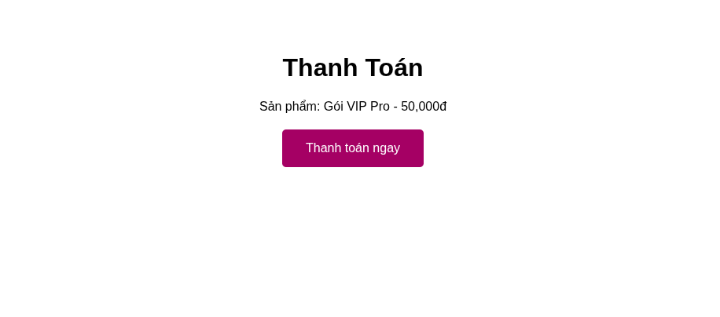
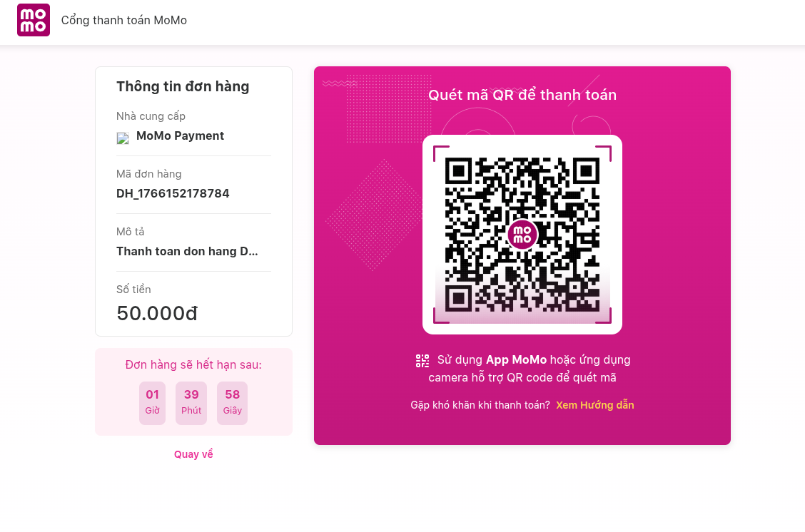
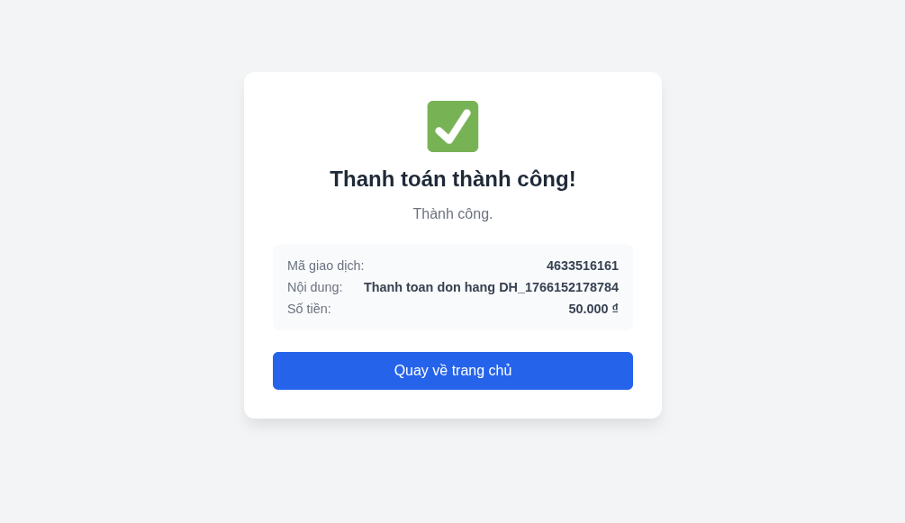

## Payment Labs

 This is a simple project by me demonstrating how to integrate the MoMo payment gateway into a website. I kept everything minimal so you can easily understand the payment flow without getting lost in complex logic.

This project focuses on the core steps of a transaction:
1.  Creating an Order.
2.  Sending a payment request to the MoMo API.
3.  Receiving the payment URL and redirecting the user.
4.  Handling the payment result (IPN/Redirect).


###  Installation
```bash
git clone https://github.com/marcomoi395/payment-labs.git
cd payment-labs
npm install
```

### Configuration (Important!)
To run this demo, you need a set of API Keys (partnerCode, accessKey, secretKey, etc.).

💡 Quick Tip for Test Keys: Instead of registering a business account just for testing, you can grab valid test keys directly from [the official MoMo repository](https://github.com/momo-wallet/payment).

### Usage
Start the server:

```bash
npm start
```

Open your browser and visit http://localhost:3000 (or your configured port), click the Pay with MoMo button, and then use the [MoMo App (Test version)](https://developers.momo.vn/v3/vi/download/) or follow the MoMo documentation to simulate a successful transaction.

### Payment Flow
1. Client requests payment -> Server generates signature & sends request to MoMo.
2. MoMo returns a payUrl.
3. Client is redirected to the MoMo payment page (QR Code / Card input).
4. After payment, MoMo redirects the user back to your site with the result.


| Screenshot | Description |
| :---: | :--- |
|  | The user clicks the **Pay with MoMo** button to initiate the transaction. |
|  | The server processes the request and returns a JSON object containing the `payUrl`. The client redirects the user to the MoMo payment page to scan the QR code or input card details.|
|  | After successful payment, MoMo redirects the user back to your website, and a success confirmation is displayed. |